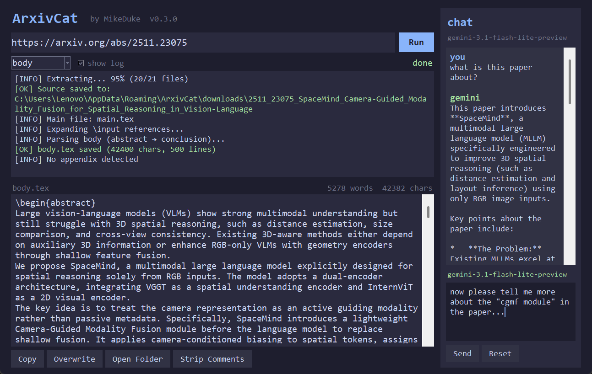

# ArXivCat

[中文说明](README_zh.md)

ArXivCat is a small desktop tool for downloading arXiv source packages, expanding LaTeX `\input` / `\include`, and exporting cleaner paper text into `body.tex` and `appendix.tex`.

It is designed for a practical workflow: paste an arXiv URL or ID, inspect the extracted result, make small edits, and optionally ask a lightweight Gemini chat panel about the currently loaded paper content.



## What it does

- downloads arXiv source tarballs from an arXiv URL, PDF URL, or raw arXiv ID
- extracts the source into a local cache
- expands nested LaTeX `\input` and `\include`
- detects the main TeX file and exports:
  - `body.tex`
  - `appendix.tex` when available
- provides a Tkinter GUI for previewing and editing extracted content
- includes a small right-side Gemini chat panel with resettable short-term memory

## What it does not try to do

ArXivCat is intentionally narrow in scope.

- It does not try to be a full LaTeX compiler.
- It does not promise perfect parsing for every paper source tree.
- The chat panel is helpful for lightweight reading assistance, but it is not a full retrieval system.

## Screenshot

The screenshot above is referenced with a relative path so it renders correctly on GitHub and in forks.

## Installation

### Python environment

```bash
pip install -r requirements.txt
```

If you want to use the chat panel, set `GEMINI_API_KEY` in your environment.

### Run from source

GUI:

```bash
python main.py
```

CLI:

```bash
python cli.py --url 2601.11514
python cli.py --url https://arxiv.org/abs/2601.11514
python cli.py --url https://arxiv.org/pdf/2601.11514
```

## GUI workflow

1. Paste an arXiv URL or ID.
2. Click `Run`.
3. Review the extracted `body` or `appendix` view.
4. Optionally use:
   - `Copy`
   - `Overwrite`
   - `Open Folder`
   - `Strip Comments`
5. Use the right-side chat panel if you want a quick explanation or summary.

## Chat panel behavior

The chat panel uses `gemini-3.1-flash-lite-preview`.

Current behavior:

- it sends the current preview text as context
- it keeps a short in-memory multi-turn history
- `Reset` clears the current chat memory
- it is best used after a paper has already been loaded into the preview

## Output locations

- cache: `%APPDATA%/ArxivCat/downloads/`
- extracted output: `%APPDATA%/ArxivCat/outputs/`

If a cache directory becomes unreadable, ArXivCat may re-download the source or write to a `*_freshN` directory.

## Packaging

For Windows packaging, the project currently uses `build.ps1` together with PyInstaller and the `arxivcat` conda environment.

## Notes for contributors

If you are here to maintain or extend the project, read `tech_memo.md` first.
